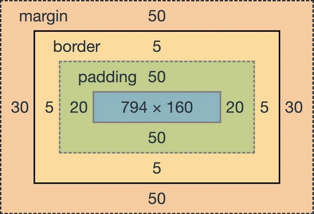

## CSS 박스 모델

</img>

웹 문서에서 내용을 배치할 때는 요소마다 박스 형태로 구성하고, 이를 *CSS 박스 모델*이라 한다. 박스 모델은 위 그림과 같이 `margin, border, padding, content` 영역으로 구성된다.

- **콘텐츠 (content):** 실제 요소의 내용이 들어감
- **테두리 (border):** 요소의 윤곽선
- **외부 여백 (margin):** 요소와 요소 사이의 빈공간
- **내부 여백 (padding):** 내용과 테두리 사이의 빈공간

또한 박스 모델에는 `top, right, bottom, left`라는 방향이 있으며, 속성이 박스 모델의 각 방향에 따로 영향을 줄 수 있는 경우 선언 순서는 top 에서부터 시계 방향으로 돌아간다 (top -> right -> bottom -> left). 만약 속성 값을 4개보다 적게 선언할 수 있는 경우 다음과 같이 묶이게 된다:

- **1개:** 전체 적용 (top + right + bottom + left)
- **2개:** 상하 / 좌우 적용 (top + right / bottom + left)
- **3개:** 상 / 좌우 / 하 적용 (top / right + left / bottom)
- **4개:** 상하좌우 따로 적용 (top / right / bottom / left)

## 블록 레벨과 인라인 레벨

박스 모델은 *블록 레벨* 요소와 *인라인 레벨* 요소를 다르게 나열한다. 여러 요소들을 어떻게 배치할지는 이러한 박스 모델을 기반으로 이루어지기 때문에 *박스 모델의 작동 방식*을 잘 기억해야 한다.

| 레벨   | 나열 방법         | 대표 태그                 |
| :----: | :----:            | :----:                    |
| 블록   | 한 줄 전체를 차지 | `<h>, 
, 
`         |
| 인라인 | 콘텐츠만큼만 차지 | `, , <strong>` |

> #### 주의
>   
> 인라인 레벨 요소는 다른 웹 요소와 어울려서 표시되어야 하기 때문에 실제 적용되는 margin과 padding은 정확하게 지정된 값으로 적용되지 않는다.

## 속성

### width, height

콘텐츠 영역의 크기를 지정할 때, 너비는 `width`, 높이는 `height` 속성을 사용한다.

### box-sizing

width와 height는 padding과 border를 포함하지 않은 컨텐츠 영역 자체의 크기만을 지정하기 때문에, 실제 요소의 크기는 컨텐츠의 크기에 해당하는 방향의 padding과 border-width를 더해야 한다. 그러나 `box-sizing` 속성을 `border-box`로 설정하면 해당 값을 포함하여 크기를 지정할 수 있다 (이 경우에도 margin은 계산되지 않는다).

### box-shadow

박스 모델에 그림자 효과를 준다.

### border-style

테두리의 스타일을 결정한다. 가장 많이 쓰이는 건 다음과 같다:

| 종류 | 설명 |
| :----: | :---- |
| `none` | 테두리 없음, 기본값 |
| `solid` | 실선으로 표시 |
| `dotted` | 점선으로 표시, dashed보다 짧음 |
| `dashed` | 짧은 직선으로 표시. dotted보다 긺 |
| `boudled` | 이중선, border-width는 두 선 사이 길이 |

### border-width

테두리의 두께를 지정한다.

### border-color

테두리의 색상을 결정한다.

### border

테두리 관련 스타일을 한꺼번에 묶어서 지정할 수 있다. 아래처럼 세분화된다:

- border-top
- border-right
- border-bottom
- border-left

### border-radius

꼭짓점을 둥글게 만드는 데 사용된다. `px`처럼 고정값을 사용할수도 있고, `%`를 사용하여 박스 요소의 너비와 높이 백분율에 맞출수도 있다. 수치 두 개를 적고 슬래시(`/`)로 구분하여 타원형 꼭짓점을 만들 수도 있다. 아래처럼 세분화된다:

> 세분화 속성을 사용할 경우 타원을 만드는 데 슬래시(`/`) 구분은 불필요하다.

- border-top-left-radius
- border-top-right-radius
- border-bottom-right-radius
- border-bottom-left-radius

### margin

요소와 요소 사이의 여백, 즉 현재 요소 바깥의 여백을 조절하는 데 사용된다. 고정치를 넣으면 해당하는 수치만큼, 백분율을 넣으면 박스 모델을 포함한 부모 요소를 기준으로 지정된다. `auto` 속성을 넣으면 `display` 속성에서 지정한 값에 맞게 자동으로 조절된다.

`auto` 속성은 일반적으로 창 가운데 정렬에 사용하나, 하려면 요소의 크기가 결정되어 있어야 한다. 기본 width는 100%로 되어있기 때문에 화면의 가로 끝까지 닿으므로 auto로 설정하더라도 가운데 정렬되지 않는다.

> #### 마진 중첩
>
> 박스 모델에서 마진을 지정할 때 요소를 *세로*로 배치할 경우, 각 요소의 상하 마진끼리 만나면 값이 더 큰 쪽으로 겹쳐진다 (좌우 마진에서는 발생하지 않음). 이는 여러 요소를 세로로 배치할 때 맨 위의 마진과 맨 아래 마진에 비해 중간의 마진이 너무 커지는 것을 방지하기 위함이다.

### padding

콘텐츠 영역과 테두리 영역 사이의 여백을 말한다. 사용법은 `margin`과 거의 같다.
